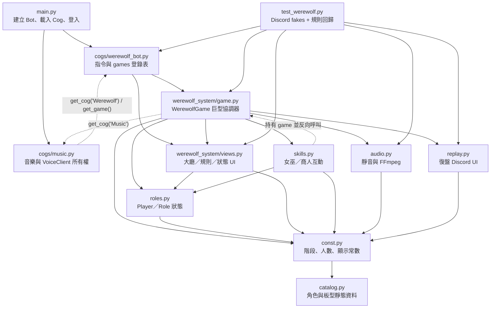
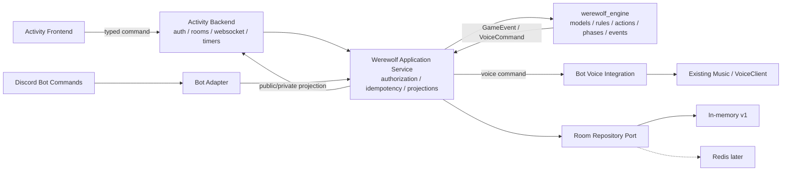

# 狼人殺相依關係圖（階段 1）

基準：`08735ea`
目的：標出現有模組責任、所有 Discord 耦合類型、可抽離邊界與後續 adapter 位置。

## 現有模組圖

## 檔案責任與耦合程度

「文字命中」是 `discord`、interaction、ctx、channel send、DM、member edit、voice client、thread 等直接耦合指標的保守計數；它不包含 `roles.Player.user` 這種以通用名稱隱藏的 Discord 物件。

| 檔案 | 行數 | 直接耦合文字命中 | 實際責任 | 邊界判定 |
|---|---:|---:|---|---|
| `cogs/werewolf_bot.py` | 152 | 35 | Cog、指令、guild → game 記憶體登錄、大廳發布 | Bot transport／adapter |
| `werewolf_system/__init__.py` | 2 | 0 | 匯入 `game` 並 wildcard 匯出常數 | 目前讓任何 package import 都連帶需要 Discord；需拆輕量入口 |
| `werewolf_system/catalog.py` | 221 | 0 | 陣營、57 角色資料、23 板型 | 最乾淨的 domain data 候選 |
| `werewolf_system/const.py` | 30 | 0 | 音效路徑、階段、板型名稱、人數 | domain 常數與 Bot 路徑混在一起 |
| `werewolf_system/roles.py` | 167 | 0 | 玩家 wrapper、角色能力旗標、局內狀態 | Role 可抽離；Player 隱含依賴 Discord user |
| `werewolf_system/game.py` | 3,132 | 315 | 房間、狀態機、規則、I/O、語音、計時、復盤 | 必須逐 command／resolver 拆分，禁止整檔搬移 |
| `werewolf_system/skills.py` | 335 | 51 | 商人、女巫、幸運兒邏輯與 Discord 面板 | 規則／transport 混合 |
| `werewolf_system/views.py` | 526 | 87 | Discord View、Select、Button、Embed | 純 Discord presentation，Activity 重寫 |
| `werewolf_system/audio.py` | 116 | 16 | Guild/member 靜音與 VoiceClient/FFmpeg | Bot voice adapter |
| `werewolf_system/replay.py` | 212 | 14 | 將記憶體事件轉成 Discord 復盤 UI | event reader 可重構；UI 重寫 |
| `test_werewolf.py` | 857 | 大量 fake | 46 項回歸測試 | 作為舊行為契約；新增純核心測試另放 engine |

## import 與執行期相依

### 靜態 import

| 來源 | 直接 import |
|---|---|
| `werewolf_bot.py` | `discord`、`discord.ext.commands`、`game`、`const`、`views` |
| `game.py` | `discord`、`asyncio`、`copy`、`random`、`Counter`、`const.*`、`roles.*`、7 個 view／embed、`AudioManager`、`SkillManager`、`ReplayView` |
| `skills.py` | `discord`、`discord.ui`、`const.*`、`Witch`／`AwakenedWitch` |
| `views.py` | `discord`、`discord.ui`、`const.*`、5 個角色類別 |
| `audio.py` | `discord`、`asyncio`、`SOUND_FOLDER` |
| `replay.py` | `discord`、`discord.ui`、陣營常數 |
| `roles.py` | `const.*`，因此同時引入 catalog、階段、板型顯示資料及音效路徑 |
| `const.py` | `catalog.*` |

### 執行期反向依賴

- `SkillManager` 保存完整 `WerewolfGame`，技能操作後反向呼叫 `check_phase_*_end()`、`log_event()` 與 channel。
- 所有 `View`／`Select` 保存 `WerewolfGame` 或 `Player`，callback 直接呼叫 game 方法。
- `WerewolfGame` 透過 `bot.get_cog("Werewolf")` 反向移除自己，也透過 `bot.get_cog("Music")` 接管／釋放語音。
- `music.py` 又透過 `bot.get_cog("Werewolf")` 與 `get_game(ctx)` 判斷遊戲是否進行中。
- 這不是 Python import cycle，但形成執行期雙向耦合，讓 domain 無法在 Bot 外獨立啟動。

### wildcard import 風險

- `const.py` 使用 `from .catalog import *`。
- `roles.py`、`game.py`、`skills.py`、`views.py` 使用 `from .const import *`。
- `werewolf_system/__init__.py` 又重新匯出 `const.*`。

結果是依賴來源不透明、名稱衝突難追蹤、測試匯入單一資料模組也會先執行 package `__init__` 並載入 Discord game。新核心應使用明確 import，且 `werewolf_engine/__init__.py` 不得載入 transport。

## `WerewolfGame` 狀態所有權

### 可序列化或可轉換的概念

| 現有欄位 | 概念 | 問題／目標 |
|---|---|---|
| `players` | 玩家與座位順序 | `Player.user` 不可序列化；改存 player_id、discord_user_id、display snapshot、seat、role_id、status |
| `phase`、`round_num` | 階段與回合 | 可保留；補 `phase_started_at`、`phase_ends_at`、state revision |
| `board_id` | 板型 | 已是 ASCII；板型規則需完整化 |
| `night_actions` | 已行動玩家 | set 需轉 list／set schema，名稱應更明確 |
| `wolf_votes`、`votes`、`stop_votes` | 投票狀態 | 拆成 `VoteState`；補 request/action 去重資料 |
| `wolf_target(s)` | 狼刀結算 | 應成 action/result，不宜作多個平行欄位 |
| `role_actions` | 夜間行動 | tuple key 不適合 JSON；改成 `NightAction[]` 或字串 ID map |
| `lucky_data` | 商人受贈技能 | 任意 dict；改明確 model |
| `deaths_tonight`、`pending_shooters` | 待結算序列 | 改 typed pending effects／resolution queue |
| 各 `pending_*`、`*_target` | 特殊角色跨階段狀態 | 現在散在 game；應收進 role state 或 typed effect |
| `game_log` | 復盤事件 | payload 含名稱與中文；改 `ReplayEntry`／`GameEvent`、ID/key、schema version |

### 絕對不能進核心狀態的欄位

| 欄位 | 物件／資源 | 替代方式 |
|---|---|---|
| `bot` | `commands.Bot` | adapter dependency，不進 `GameState` |
| `channel` | Discord TextChannel／Thread parent | transport routing metadata 存外層 session |
| `host` | Discord Member/User | 核心只存 host player/user ID |
| `Player.user` | Discord Member/User | 只存字串／整數識別與顯示 snapshot |
| `lobby_message` | Discord Message | Bot adapter 的 message reference |
| `wolf_thread` | Discord Thread | Bot adapter 的 thread reference |
| `_state_lock` | `asyncio.Lock` | room runtime/service 管理，不序列化 |
| View、Button、Select、Future | Discord UI／async runtime | transport session；核心只產生 command/result/event |

## Discord 耦合位置

### `cogs/werewolf_bot.py`

| 行／方法 | Discord API／物件 | 判定 |
|---|---|---|
| 1–18 | `discord`、`commands.Cog` | Bot adapter 保留 |
| 23–61 `_publish_lobby()`／`_restore_waiting_lobby()` | `ctx.channel`、`ctx.send`、Message.edit、HTTPException | UI 重寫；Activity 不直接使用 |
| 63–93 `create_game()` | hybrid command、guild、ctx author/channel | command adapter；房間 service 後移 |
| 96–122 `get_game()`／rules／status | guild、Embed、View、ephemeral | adapter；查詢改讀 service projection |
| 123–149 force stop／unload | permission decorator、ctx、Cog lifecycle | adapter；核心暴露 abort command |

### `werewolf_system/roles.py`

| 行／方法 | 隱含耦合 | 判定 |
|---|---|---|
| 6–19 `Player` | 建構子接受 Discord user；`display_name`、`mention` 直接代理 user | 必須重構，不能搬進核心 |

`Role` 與動態角色類別沒有直接 Discord 呼叫，但 `name` 同時是中文 ID／顯示字串，`state` 可放 set 與任意物件，尚不符合 JSON 模型。

### `werewolf_system/game.py`

以下列出所有耦合區塊；區塊內的純判定仍應切出，不代表規則要重寫。

| 行／方法群 | Discord／runtime 耦合 |
|---|---|
| 1、9–22、28–31、81–93 | import discord/views/audio/replay；保存 bot/channel/host/message/thread/lock |
| 237–331 `_collect_awakened_dreamer_kills()` | DM、臨時 View／Button、Interaction、Channel、45 秒 Future/timeout |
| 333–398 host、登錄、語音方法 | Bot owner/Cog、Guild、Member.voice、AudioManager、Music Cog |
| 403–552 大廳與開始 | Interaction、ephemeral、Message edit/delete、VoiceClient、Embed、View、10 秒 sleep |
| 616–644 `create_wolf_thread()` | private Thread、add_user、mention、send/delete |
| 649–764 身分與強制入夜 | Interaction、ephemeral Embed、Bot owner、followup |
| 770–883 `start_night()` | Audio task、mute task、Thread、View／Button、Channel Embed |
| 984–1058 action panels／skip | Interaction、動態 View／Select／Button、硬編碼訊息 |
| 1060–1213 `handle_night_action()` | 驗證與規則混合 Interaction 回應；轉換目標後直接送私密結果；轉化者 DM |
| 1215–1359 吞噬／商人 | 多階段 Discord View／Select／Button 與 Interaction |
| 1361–1535 phase 1/2 transition | 規則完成後直接呼叫下一個送 UI 的方法；下半夜 View、Button、Channel Embed |
| 1540–2025 `start_day()` | 純結算與 Audio stop、Thread delete、DM 決策結果、Channel／Embed、mute、下一 View 混合 |
| 2066–2096 voting/shooter prompt | Channel、Embed、VotingView、ShooterView |
| 2101–2488 投票、回溯、河豚、放逐 | Interaction、公開 Channel、Embed、臨時 View、90 秒 sleep |
| 2490–2856 白天技能 | Interaction、動態 Select／View、mention、45 秒 sleep、公開訊息 |
| 2859–3009 射擊 | Interaction、Channel、Shooter UI 流程 |
| 3026–3068 end game | audio/mute/Cog 清理、Embed、Channel、ReplayView、Thread |
| 3070–3095 abort | audio/mute、Message edit、Thread delete、Cog unregister |
| 3106–3132 stop vote | Interaction、Channel、直接 `end_game()` |

### `werewolf_system/skills.py`

全檔的 public async 方法都接受 Interaction 或向 Channel 送訊息：

- 11–72：夜晚／幸運兒 action 回應。
- 75–91：商人賜能回應。
- 94–168：女巫救人與多狼刀 Select。
- 170–223：女巫毒人 Select。
- 225–277：覺醒女巫協助者 Select。
- 279–335：Button 私密投票、mention 與公開結算。

`SkillManager` 的真正規則應成 `submit_action(state, command) -> events`；UI 不應存在於同一 service。

### `werewolf_system/views.py`

整檔為 Discord presentation：

- 15–46：Discord color 與顯示 helper。
- 49–148：板型、大廳、身分 View。
- 151–286：夜間、時波、商人、女巫、幸運兒 UI。
- 288–405：射擊、投票、白天特殊行動 UI。
- 407–526：板型百科、身分卡、戰況卡、Embed。

其中 `_composition_by_camp()`、`_progress_bar()` 是純格式化，但回傳 Discord／中文 presentation，不應進核心。

### `werewolf_system/replay.py`

- `ReplaySelect` 和 `ReplayView` 繼承 Discord UI 類別。
- callback 直接編輯 Discord Message。
- `_create_*_embed()` 回傳 Discord Embed。
- `_format_event()` 把未版本化事件轉成硬編碼中文。

應保留「按回合查詢復盤」需求，將事件查詢搬入 query service，Bot 與 Activity 各自呈現。

### `werewolf_system/audio.py`

- 25–48：從 guild 找 member，使用 `member.edit(mute=...)`。
- 50–105：使用 Guild VoiceClient、`discord.FFmpegOpusAudio`。
- 107–116：停止 VoiceClient。

此檔不能進 engine。後續由 Bot integration 消費 `MUTE_*`、`PLAY_AUDIO`、`RESTORE_VOICE_STATE` 事件。

## 音樂系統的跨模組依賴

| 位置 | 行為 | 遷移風險 |
|---|---|---|
| `music.py:1496-1501` | 查 Werewolf Cog 與 `game.phase`，阻擋音樂操作 | 新後端若不在同程序，不能再直接讀 game 物件 |
| `music.py:2992-3031` | `prepare_external_audio()` 清佇列、停止播放、交出 VoiceClient | 必須由 Bot integration 明確接管；注意不可誤清新歌 |
| `music.py:3033-3050` | `release_external_audio()` 歸還 VoiceClient | 所有結束、abort、例外路徑必須 exactly-once 或冪等 |
| 多個音樂指令 | `external_audio` 或 active game 時拒絕控制 | 遷移後需有可查詢的 voice lease 狀態，不能依 Activity 前端 |

## 現有測試相依

- `test_werewolf.py` 建立 FakeUser、FakeGuild、FakeChannel、FakeBot、FakeInteraction 等替身，證明規則測試被迫攜帶 Discord 介面形狀。
- 測試直接建 `WerewolfGame(FakeBot(), FakeChannel(), host)`，也直接修改 `phase`、`role_actions` 等內部欄位。
- 這些 46 項測試應保留為 legacy contract；抽離時新增 engine 單元測試，不要直接把舊測試刪除或改到失去回歸價值。
- 新核心測試不應 import `discord`，也不應建立 FakeInteraction。

## 建議的目標邊界

### 核心不得依賴

- `discord.py` 或 Discord SDK。
- FastAPI、WebSocket、React。
- Redis／PostgreSQL client。
- 真實時間 sleep、asyncio task 或 View timeout。
- 顯示名稱、mention、中文 UI 句子、Embed、MP3 路徑。

### 核心可以輸入／輸出

- 穩定字串 ID、enum、數字、布林、UTC timestamp、JSON-compatible list/map。
- `GameCommand`：actor ID、action ID、target ID、request ID、expected revision。
- `GameEvent`：event key、recipient scope、payload IDs、sequence/revision。
- `GameState` 與針對單一玩家的 `PlayerProjection`。
- `VoiceCommand`：固定 key 與玩家 ID，不包含 Discord member。

## 現有程式到目標模組的映射

| 現有來源 | 目標責任 | 備註 |
|---|---|---|
| `catalog.py` camps／role metadata | `werewolf_engine/roles/catalog.py` | 角色 ID 先轉 ASCII；顯示文字改 locale key |
| `catalog.py` BoardSpec | `werewolf_engine/boards/catalog.py` | 增加 victory、witch、guard、speech、reveal、sheriff 等規則 |
| `roles.py` Role fields | `werewolf_engine/models/role.py` | 明確 typed role state，不能任意 dict/set |
| `roles.py` Player | `werewolf_engine/models/player.py` | 移除 Discord user，只存 ID／seat／status |
| `game.py` constructor fields | `GameState`、`RoomState`、`VoteState` | 區分持久狀態、衍生狀態、runtime 資源 |
| target/task helpers | `rules/targeting.py`、`actions/availability.py` | 第一批 characterization tests |
| `assign_roles()` | `rules/assignment.py` | 注入 seed/RNG，事件只對本人投影角色 |
| `handle_night_action()` | `actions/submit.py` + role handlers | 先驗證 command，再產生事件 |
| `start_day()` resolution | `phases/night_resolution.py` | 拆 effects queue，固定優先序並測死亡順序 |
| vote／exile／shoot | `phases/day.py`、`rules/voting.py`、`rules/death.py` | 平票與技能規則板型化 |
| `check_winner()` | `rules/victory.py` | 板型化並處理第三方 |
| `log_event()` | `events/models.py`、`replay/service.py` | schema version、sequence、ID/key payload |
| `views.py` | `bot/integrations/werewolf_views.py` + Activity React | 不進 engine |
| `audio.py` | `bot/voice/werewolf_voice.py` | 消費 voice command，保證 restore |
| `replay.py` | Bot replay presenter + backend replay query | 共用事件，不共用 UI |

此依賴圖支援「同一套規則、兩個 transport」：舊 Discord Bot UI 與 Activity 後端都只能呼叫 application/core，不再各自維護規則。
